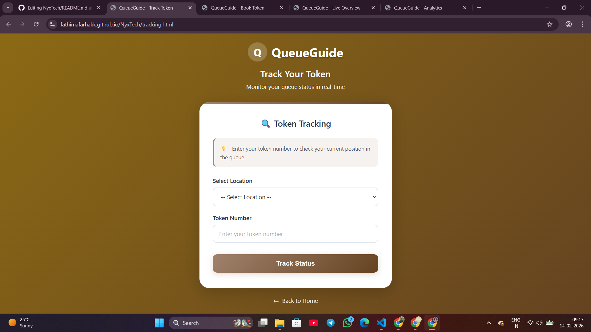

  

# [QUEUE GUIDE] 🎯

## Basic Details

### Team Name: [NyxTech]

### Team Members
- Member 1: fathima farha kk - EMEA college of arts and science
- Member 2: [Ayisha ishra kk] - [EMEA college of arts and science]

### Hosted Project Link
[visit here](https://fathimafarhakk.github.io/NyxTech/)

### Project Description
[QueueGuide is a real-time digital queue management system that allows users to book and track service tokens online, reducing physical waiting time.

Staff can manage token flow, update live serving status, and monitor service performance through a Firebase-powered dashboard.

The system supports multiple locations with centralized live updates for accurate queue tracking.]

### The Problem statement
[Long physical waiting times and lack of real-time visibility in service queues cause frustration, inefficiency, and overcrowding.]
### The Solution
[A real-time, location-based digital queue system that allows users to book tokens online and track their turn while staff manage and update the queue through a live dashboard.?]

---

## Technical Details

### Technologies/Components Used

**For Software:**
- Languages used: [ html,css,js]
- Frameworks used: [firebase(backend as service)]
- Libraries used: [Firebase JS SDK (v10 modular version)]
- Tools used: [ VS Code, Git, ]

---

## Features

List the key features of your project:
- Feature 1: [Online Token Booking – Users can book tokens remotely by selecting location and entering basic details.]
- Feature 2: [Real-Time Queue Tracking – Users can check their live queue position and see current serving status instantly.]
- Feature 3: [Staff Dashboard Control Panel – Staff can call next token, check-in, check-out, and manage queue operations.]
- Feature 4: [Multi-Location Queue Management – Separate live queue handling for different service locations using Firebase.]

---

---

## Project Documentation

### For Software:

#### Screenshots (Add at least 3)

*this is the index page
it contains the 3 core feature of this web
booking,staff entering the data and  the tracking the tocken*

*this shows the current status of the token*

*here we can see the estimated time to reach the location *

---

## Project Demo

## AI Tools Used (Optional - For Transparency Bonus)

If you used AI tools during development, document them here for transparency:

**Tool Used:**  GitHub Copilot,ChatGPT, Claude

**Purpose:** 
- Example: "Generated code"
- Example: "Debugging assistance for async functions"
- Example: "Code review and optimization suggestions"

**Key Prompts Used:**
- "Create a REST API endpoint for user authentication"
- "Debug this async function that's causing race conditions"
- "Optimize this database query for better performance"

**Percentage of AI-generated code:** [Approximately 80%]

**Human Contributions:**
- Custom business logic implementation
- Integration and testing
- UI/UX design decisions

*Note: Proper documentation of AI usage demonstrates transparency and earns bonus points in evaluation!*

---

## Team Contributions
-Fathima farha kk:  Frontend development, API integration
- Ayishan ishra:  Frontend development, API integration

---

Made with ❤️ at TinkerHub
